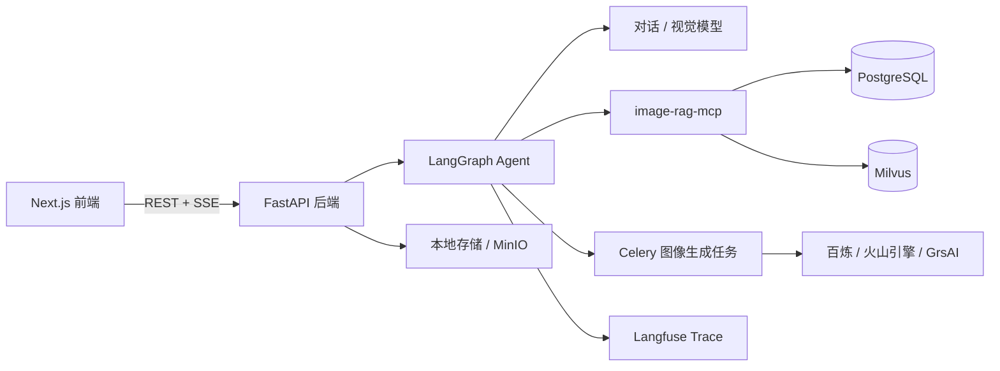
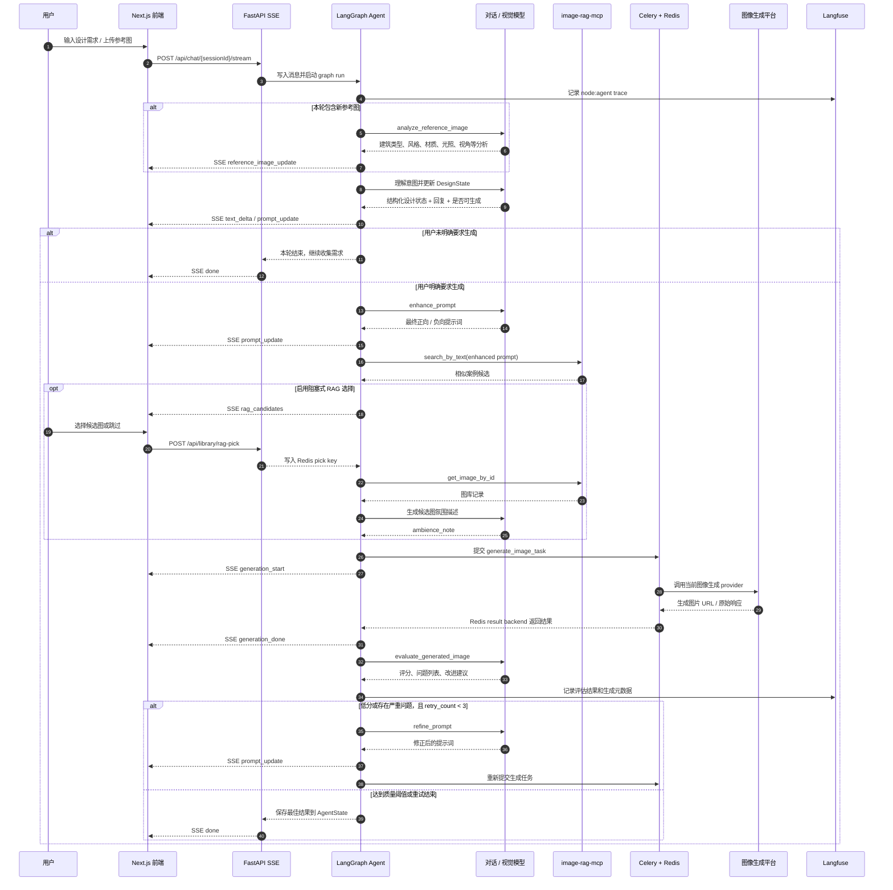

# AIGC Agent

本项目是一个面向建筑效果图生成的 Agent。AI 驱动的图生图、文生图能力正在重塑传统效果图渲染流程：设计师可以更快地将建筑模型转化为目标视觉效果，显著提升方案表达、灵感探索和设计验证的效率。但在实际使用中，生成质量高度依赖提示词，设计师往往需要寻找提示词模板，或在不同平台生成、复制、调整提示词，再回到生图工具中反复尝试，流程割裂且效率有限。

本系统希望把这一过程收束到连续的设计对话中：通过多轮交互引导用户逐步思考并沉淀设计意图，同时支持参考图、结构底图和批注图输入，让需求澄清、提示词优化、案例检索、图像生成与结果评估形成完整闭环。系统会在生成前自动增强提示词并检索相似案例，生成后再用 VLM 评估结果，并在必要时自动修正提示词重试。

## 项目亮点

- 多轮对话逐步优化提示词：Agent 将用户自然语言、参考图分析和工作区草稿合并为结构化 `DesignState`，并持续输出可编辑的 prompt draft。
- RAG MCP 语义检索：独立 `image-rag-mcp` 服务通过 FastMCP 暴露图库存储、文本检索、图片检索和详情查询能力，使用 PostgreSQL 保存元数据、Milvus 保存向量。
- 全生成链路可追踪：Agent 节点、工具调用、提示词增强、RAG 检索、生成任务和评估结果都接入 Langfuse trace，便于复盘和调优。
- 生成质量自动闭环：图片生成后由 VLM 多维度评估，低分或存在严重问题时自动调用 `refine_prompt` 修正提示词并重试，保留当前最佳结果。
- 多模态参考控制：支持结构底图、上一版批注图、用户参考图和 RAG 氛围图，不同图片会以明确槽位说明传入生成模型，降低参考图互相覆盖的问题。
- 异步可中断生成：图像生成通过 Celery + Redis 异步执行，SSE 实时推送状态；用户发起新消息时可通过 Redis cancel flag 中断旧 run。
- Dashboard 可配置模型：前端 Dashboard 支持切换对话 VLM、图像生成平台、Embedding 和 Langfuse 配置，减少硬编码配置。

## 架构概览



## Agent 时序图



## 目录结构

```text
.
├── backend/          # FastAPI、LangGraph Agent、模型调度、Celery 任务
├── frontend/         # Next.js App Router 前端、聊天工作台、Dashboard
├── image-rag-mcp/    # FastMCP 图库语义检索服务
├── docker-compose.yml
├── init-db.sql
└── DEV_SPEC.md       # 项目架构和阶段规划说明
```

## 快速启动

1. 启动依赖服务：

```bash
docker compose up -d
```

2. 配置后端模型和密钥：

```bash
cp backend/config/dashboard.yaml.example backend/config/dashboard.yaml
```

然后在 `backend/config/dashboard.yaml` 或前端 Dashboard 中填写对话模型、图像生成平台、Embedding 和 Langfuse 配置。

3. 启动后端：

```bash
cd backend
uv sync
uv run uvicorn main:app --reload --port 8000
```

4. 启动 Celery worker：

```bash
cd backend
uv run celery -A celery_app worker --loglevel=info
```

5. 启动前端：

```bash
cd frontend
npm install
npm run dev
```

默认访问：

- 前端：`http://localhost:3000`
- 后端健康检查：`http://localhost:8000/health`
- Attu / Milvus 管理：`http://localhost:8080`

## 主要流程

1. 用户在聊天工作台描述建筑需求，并可上传参考图、结构底图或批注图。
2. Agent 维护 `DesignState`，在每轮对话中增量更新建筑类型、风格、材质、光照、视角、环境等字段。
3. 用户明确要求生成时，后端才进入生成链路，先增强提示词，再调用 RAG MCP 检索相似案例。
4. 生成任务异步执行，前端通过 SSE 获得 prompt、RAG 候选、任务开始、生成完成和错误事件。
5. VLM 对生成结果打分，必要时自动修正提示词并重试，最终保留最佳结果。
6. 用户可将满意结果存入图库，后续作为 RAG 语义检索资产复用。
